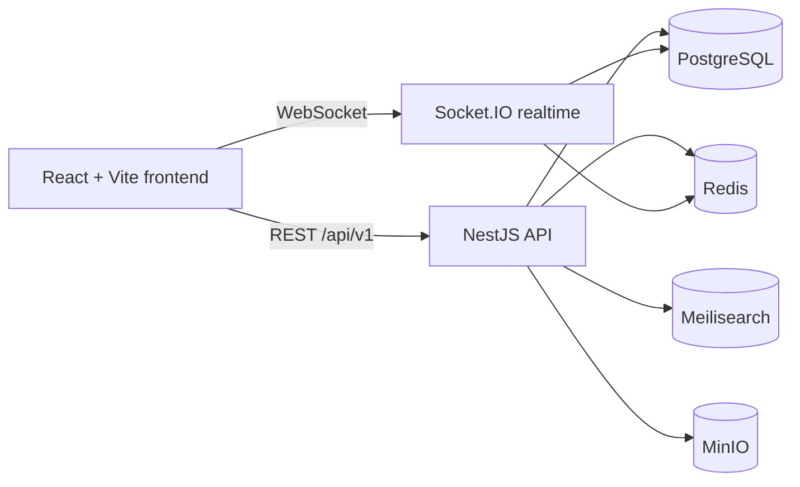
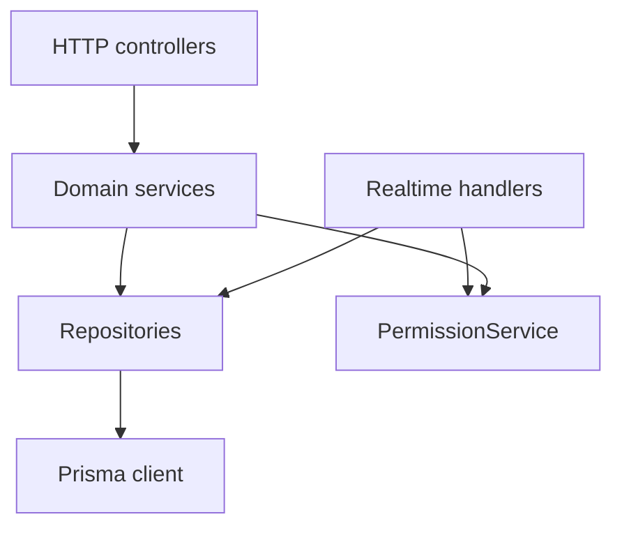
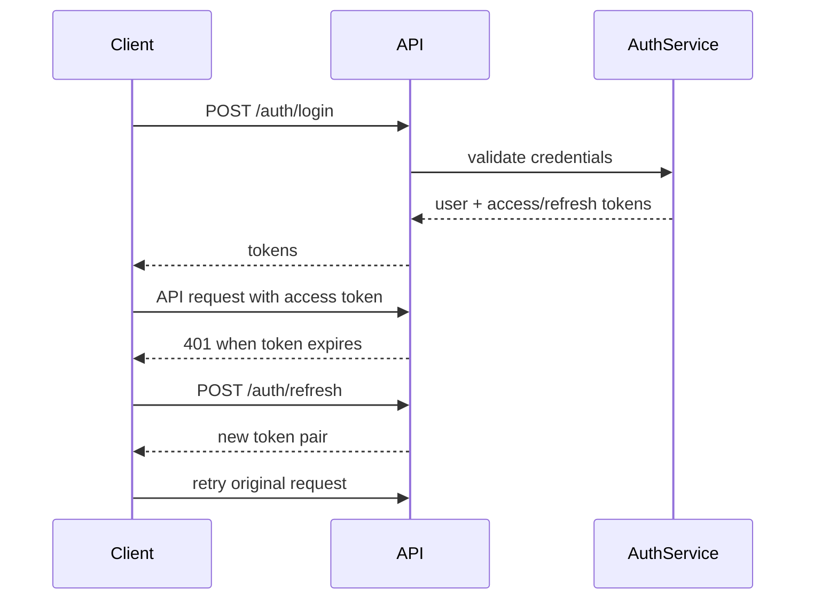

# Architecture Overview

This document summarizes the current implementation shape of the Workspace Platform.

## Runtime Topology

## Backend Module Boundaries

## Authentication Flow

## Notes

- WebSocket page events must pass the same workspace membership checks as HTTP page operations.
- OpenAPI is maintained under `specs/001-technical-spec/contracts/openapi.yaml`.
- Database and search endpoints are part of the current REST surface; notifications are currently domain-service only and not exposed as REST endpoints.
